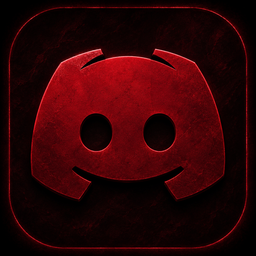

#  Retribution

A cross-platform desktop client mod for Discord, built from the [Retribution](https://github.com/Retribution-Mod/retribution-pc)/[Vencord](https://github.com/Vendicated/Vencord) ecosystem and rebadged as a standalone Retribution project.

This is **retribution-pc**, the desktop component of the Retribution project.

## Supported platforms

- Windows
- macOS
- Linux

## Quick start

Requires [Node.js](https://nodejs.org/) >= 22 and [pnpm](https://pnpm.io/).

```bash
# Clone
git clone https://github.com/Retribution-Mod/retribution-pc
cd retribution-pc

# Install dependencies
pnpm install

# Build and inject into the local Discord install (all platforms)
pnpm build
pnpm inject
```

For browser users, load the unpacked extension from `dist/chromium-unpacked` or `dist/firefox-unpacked` after running `pnpm buildWeb`.

## Resources

- Discord: https://discord.gg/GNrNbGPhZv
- GitHub: https://github.com/Retribution-Mod/retribution-pc
- Mobile plugins/themes/fonts: https://plugins-list.pages.dev and the linked community sources

## Attribution

retribution-pc is built from the [Vencord](https://github.com/Vendicated/Vencord) and [Revenge](https://github.com/revenge-mod) ecosystems. See [ATTRIBUTION.md](ATTRIBUTION.md) for the full attribution and license details for the original work.

## License

Licensed under GPL-3.0-or-later.
